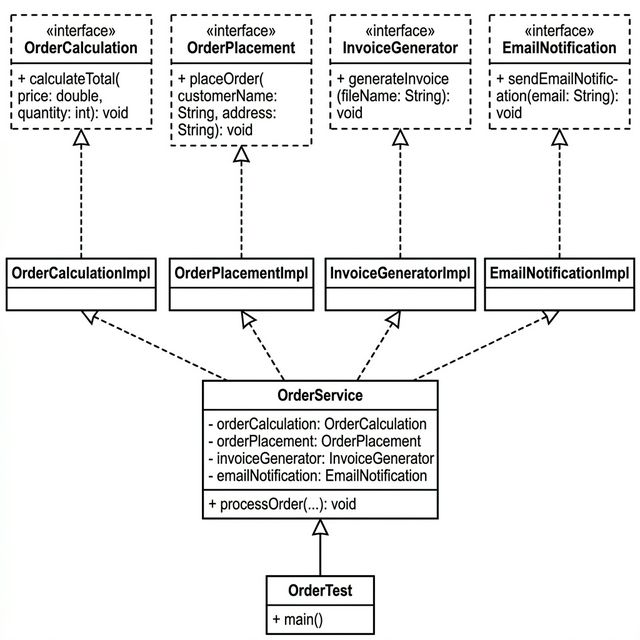

# Lab Assignment 5 — SOLID Principles

## Problem Description

The original code has a single `Order` interface that bundles **four unrelated responsibilities** into one contract:

```java
public interface Order {
    void calculateTotal(double price, int quantity);
    void placeOrder(String customerName, String address);
    void generateInvoice(String fileName);
    void sendEmailNotification(String email);
}
```

A single class `OrderAction` implements all of these methods. This design violates several SOLID principles:

### SOLID Violations in the Original Code

| Principle | Violation |
|---|---|
| **S — Single Responsibility Principle (SRP)** | `OrderAction` handles four distinct responsibilities: calculation, placement, invoice generation, and email notification. Any change to one responsibility forces modification of the entire class. |
| **O — Open/Closed Principle (OCP)** | To add a new calculation strategy (e.g., with tax or discounts) or a new notification method (e.g., SMS), you must modify the existing `OrderAction` class instead of extending it. |
| **L — Liskov Substitution Principle (LSP)** | If a subclass of `OrderAction` does not need all four behaviors (e.g., an order that doesn't require email), it would have to either leave methods empty or throw exceptions, violating the expected behavior of the `Order` type. |
| **I — Interface Segregation Principle (ISP)** | The `Order` interface forces every implementor to provide all four methods, even when only a subset is needed. As the original code notes: *"These methods might not be needed for all orders."* |
| **D — Dependency Inversion Principle (DIP)** | The test class `OrderTest` directly creates `OrderAction` (a concrete class). High-level logic is tightly coupled to the low-level implementation, making it impossible to swap behaviors without changing client code. |

---

## Solution: Applying SOLID Principles

The solution decomposes the monolithic interface into **four focused interfaces**, each with a **dedicated implementation class**, and introduces an **`OrderService`** that orchestrates the workflow via **dependency injection**.

### How Each SOLID Principle Is Applied

#### 1. Single Responsibility Principle (SRP)
Each class now has exactly **one reason to change**:
- `OrderCalculationImpl` — only handles price calculation
- `OrderPlacementImpl` — only handles placing orders
- `InvoiceGeneratorImpl` — only handles invoice generation
- `EmailNotificationImpl` — only handles email notifications
- `OrderService` — only orchestrates the workflow (delegates to specialized services)

#### 2. Open/Closed Principle (OCP)
The system is **open for extension, closed for modification**:
- To add a discounted calculation → create `DiscountedOrderCalculation implements OrderCalculation`
- To add SMS notifications → create `SmsNotification implements EmailNotification`
- No existing class needs to be modified

#### 3. Liskov Substitution Principle (LSP)
Every implementation can be **substituted** for its interface without breaking the program:
- `OrderCalculationImpl` can replace any `OrderCalculation` reference
- Any new implementation of these interfaces will work correctly in `OrderService`

#### 4. Interface Segregation Principle (ISP)
The fat `Order` interface is split into **four lean interfaces**:
- `OrderCalculation` — calculateTotal()
- `OrderPlacement` — placeOrder()
- `InvoiceGenerator` — generateInvoice()
- `EmailNotification` — sendEmailNotification()

Clients only depend on the interfaces they actually use.

#### 5. Dependency Inversion Principle (DIP)
`OrderService` depends on **abstractions** (interfaces), not concrete classes:
```java
public OrderService(OrderCalculation orderCalculation,
                    OrderPlacement orderPlacement,
                    InvoiceGenerator invoiceGenerator,
                    EmailNotification emailNotification) { ... }
```
Dependencies are **injected** through the constructor, allowing easy swapping of implementations.

---

## UML Class Diagram



---

## Project Structure

```
Lab Assignment 5 SOLID Principles/
├── README.md
├── uml_class_diagram.png
├── src/
│   ├── OrderCalculation.java        ← Interface (ISP)
│   ├── OrderPlacement.java          ← Interface (ISP)
│   ├── InvoiceGenerator.java        ← Interface (ISP)
│   ├── EmailNotification.java       ← Interface (ISP)
│   ├── OrderCalculationImpl.java    ← Implementation (SRP)
│   ├── OrderPlacementImpl.java      ← Implementation (SRP)
│   ├── InvoiceGeneratorImpl.java    ← Implementation (SRP)
│   ├── EmailNotificationImpl.java   ← Implementation (SRP)
│   ├── OrderService.java            ← Orchestrator (DIP)
│   └── OrderTest.java               ← Test / Demo
```

## How to Compile and Run

```bash
# Compile
javac src/*.java -d out

# Run
java -cp out OrderTest
```

### Expected Output

```
Order total: $20.0
Order placed for John Doe at 123 Main St
Invoice generated: order_123.pdf
Email notification sent to: johndoe@example.com

--- Using individual services independently ---
Order total: $100.0
Order placed for Jane Smith at 456 Oak Ave
```
